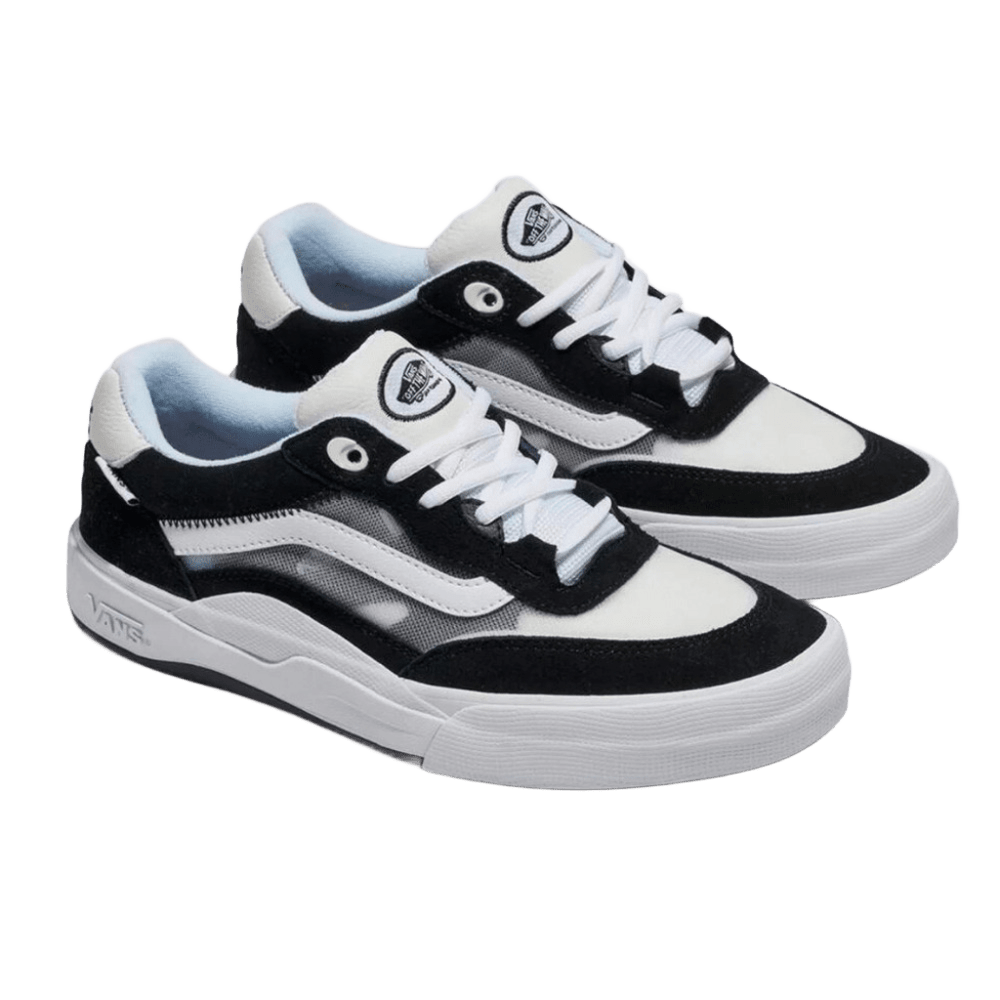
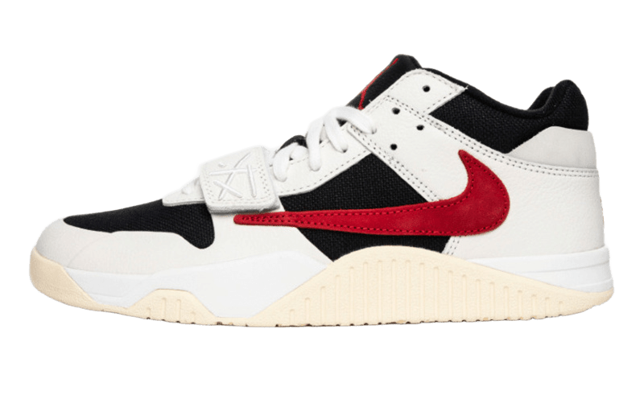

# Drop Pace 


**Your destination for the latest and greatest in sneaker culture.**

[](https://skillicons.dev)


---

Welcome to Drop Pace, a modern e-commerce platform built with Next.js, dedicated to providing a curated selection of sought-after sneakers. Explore new releases, iconic collaborations, and timeless classics.

## ✨ Features

* **⚡️ Blazing Fast Performance:** Built with Next.js 15 for optimal speed and SEO.
* **🖼️ Dynamic Product Display:** Browse a curated catalog featuring detailed product pages with multiple images/page.js].
* **💅 Modern & Responsive UI:** A clean, stylish interface that looks great on any device, inspired by contemporary e-commerce trends.
* **🔍 Optimized Images:** Utilizes `next/image` for efficient loading of high-quality product photos from local and remote sources.
* **✨ Smooth Animations:** Subtle animations (like the header logo via `animejs`) enhance the user experience.
* **🧩 Component-Based:** Organized structure using reusable React components (Header, Footer, Product Cards).

## 🚀 Getting Started

Follow these steps to get the project running locally:

1.  **Clone the repository:**
    ```bash
    git clone <your-repository-url>
    cd drop-pace-next
    ```

2.  **Install dependencies:**
    Choose your preferred package manager:
    ```bash
    npm install
    # or
    yarn install
    # or
    pnpm install
    # or
    bun install
    ```
   

3.  **Run the development server:**
    ```bash
    npm run dev
    # or
    yarn dev
    # or
    pnpm dev
    # or
    bun dev
    ```
   

4.  **Open your browser:**
    Navigate to [http://localhost:3000](http://localhost:3000) to see the application live!

## 📸 Sneak Peek

 | Product Grid                                    | Product Detail Page                                |
| :---------------------------------------------: | :------------------------------------------------: |
             |             |

## 🛠️ Tech Stack

* **Framework:** [Next.js](https://nextjs.org/) 15.3.5
* **Library:** [React](https://react.dev/) 19.1.0
* **Styling:** Global CSS, CSS per component
* **Animation:** [Anime.js](https://animejs.com/) 3.2.1
* **Linting:** [ESLint](https://eslint.org/) (with Next.js config)
* **Package Manager:** npm / yarn / pnpm / bun

## 📁 Project Structure

```plaintext
drop-pace-next/
├── public/
│   ├── img/
│   │   ├── apple-touch-icon.png
│   │   ├── favicon-96x96.png
│   │   ├── favicon.ico
│   │   ├── favicon.svg           # (Empty)
│   │   ├── Jumpman.jpg
│   │   ├── NewBalance8080.png
│   │   ├── site.webmanifest
│   │   ├── travis.webp
│   │   ├── Vans.jpg
│   │   ├── web-app-manifest-192x192.png
│   │   └── web-app-manifest-512x512.png
│   ├── file.svg                # (Empty)
│   ├── globe.svg               # (Empty)
│   ├── next.svg                # (Empty)
│   ├── vercel.svg              # (Empty)
│   └── window.svg              # (Empty)
├── src/
│   ├── app/
│   │   ├── produto/
│   │   │   ├── [id]/page.js
│   │   │   └── produto.css
│   │   ├── favicon.ico         # (Duplicate of public/img/favicon.ico)
│   │   ├── globals.css
│   │   ├── layout.js
│   │   ├── page.js
│   │   └── page.module.css
│   ├── components/
│   │   ├── Footer.js
│   │   └── Header.js
│   └── lib/
│       └── database.js
├── .gitattributes
├── .gitignore
├── eslint.config.mjs
├── jsconfig.json
├── next.config.js
├── next.config.mjs
├── package-lock.json
├── package.json
└── README.md 
